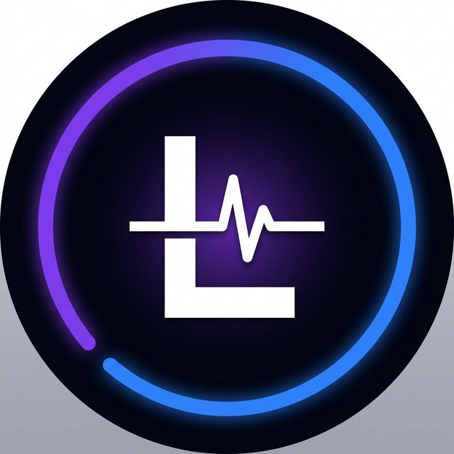

<div align="center">

  

  # LapScore — PC Health Monitor
  > **Your laptop's health, at a glance.**

  [**Download for Windows (86 MB)**](https://github.com/prani/lapscore/releases/latest)

</div>

---

LapScore is a premium, locally-hosted PC health monitor designed to give you deep insights into battery wear, CPU throttling, AI workload impacts, and cross-machine fleet monitoring. It runs 100% locally with zero cloud dependencies.

### 🖼️ Feature Previews

| **Dashboard** | **Battery Intelligence** |
|:---:|:---:|
|  |  |
| *Real-time Health Score (0-100)* | *Cycle counts & aging forecasts* |

| **AI Readiness** | **Throttle Radar** |
|:---:|:---:|
|  |  |
| *Local LLM context window calculator* | *Thermal throttling event detection* |

| **History** | **Fleet Manager** |
|:---:|:---:|
|  |  |
| *Trend analysis over time* | *Network-wide LAN device monitoring* |

## 🚀 Key Features

- **Real-time Health Score:** A comprehensive 0-100 rating based on live hardware diagnostics.
- **Battery Cycle Intelligence:** Forecasts battery replacement timelines based on deep cycle telemetry.
- **AI Workload Monitor:** Tracks local LLM resource usage (Ollama, LM Studio).
- **CPU Throttle Radar:** Pinpoints exact thermal throttling events and identifies offending processes.
- **Fleet Monitoring:** Monitor multiple LapScore instances across your local network (LAN-only).
- **Power Cost Tracker:** Translates energy footprint into user-defined currency (₹/$/€).
- **Zero Cloud & Zero Config:** All data stays on your machine. AppData-compliant architecture.

## 💾 Download

→ [**LapScore Setup 1.0.0.exe**](https://github.com/prani/lapscore/releases/latest) (Windows 10/11)

## 🛠️ Run from Source

```bash
# Clone the repository
git clone https://github.com/prani/lapscore
cd lapscore

# Install dependencies and build client
npm run setup

# Start the application in development mode
npm run electron:dev
```

## 🏗️ Tech Stack

- **Desktop Framework:** Electron
- **Frontend:** React 18, TailwindCSS, Vite
- **Backend:** Node.js (Express), SQLite (`better-sqlite3`), `systeminformation`
- **Updates:** `electron-updater` (Silent background updates via GitHub Releases)

---

<div align="center">
  <i>Built with standard web technologies. No telemetry. No accounts required.</i>
</div>
